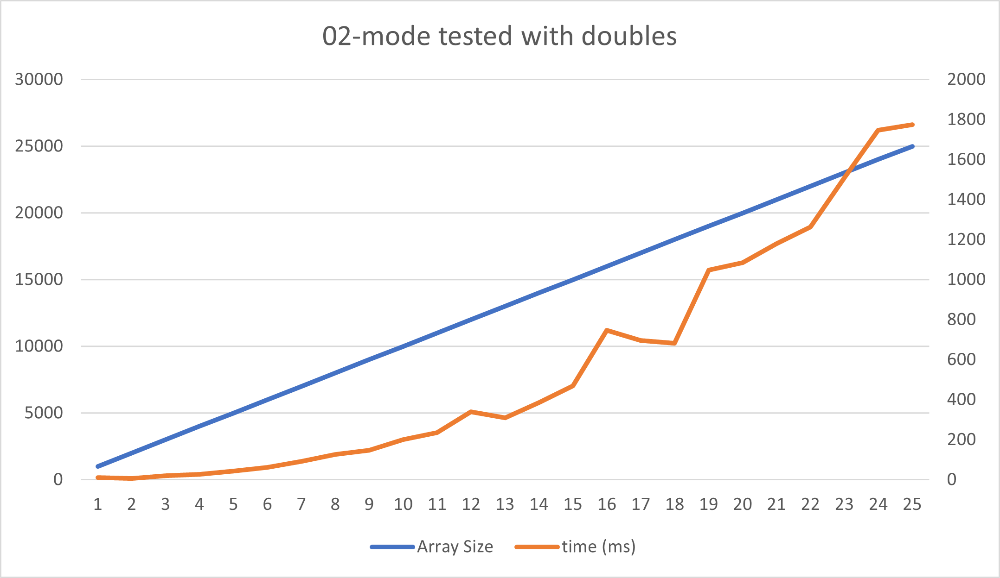
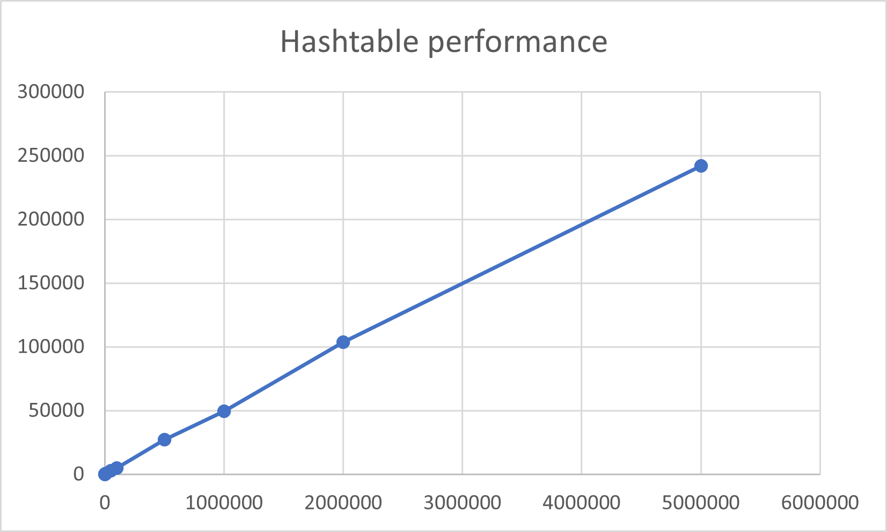
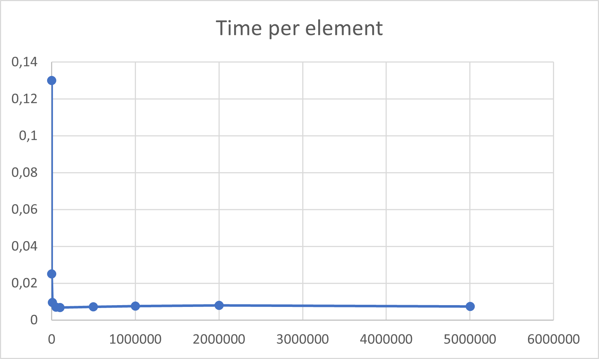
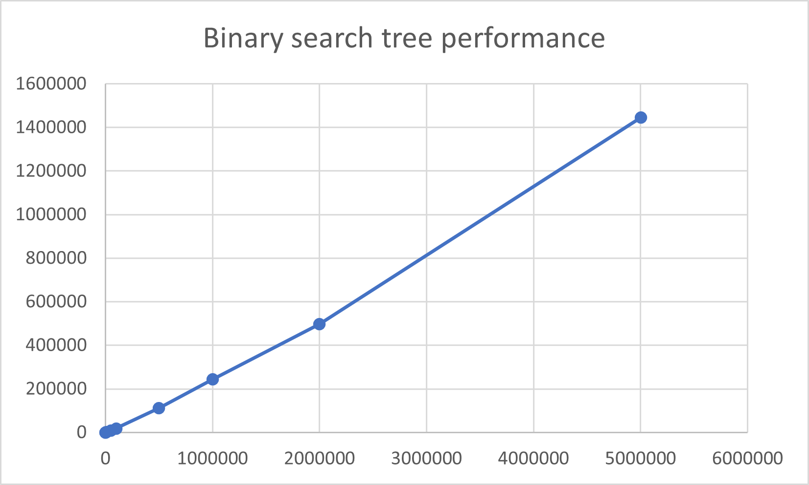
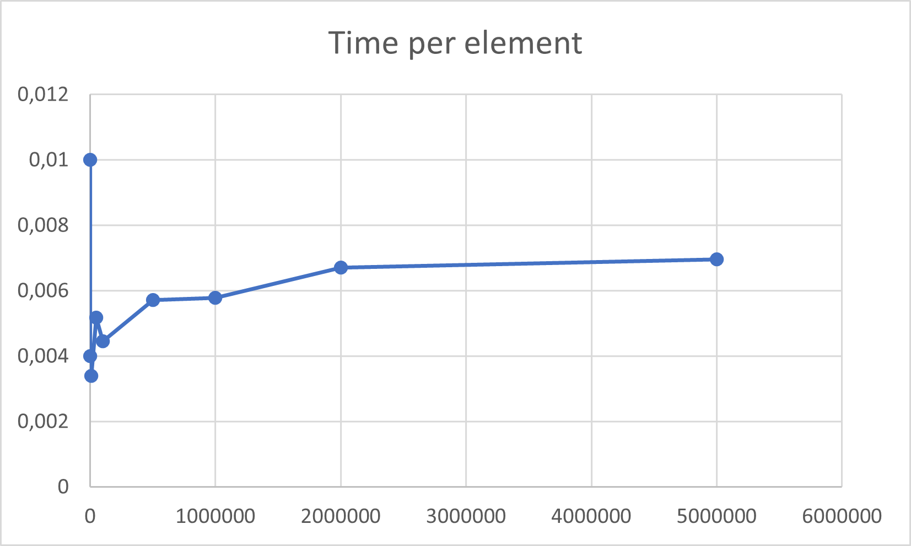

# Kurssitehtävien oppima ja raportit

Kirjoita jokaisesta alla olevasta kurssitehtävästä parilla lauseella miten tehtävän tekeminen sujui ja mitä siitä opit.

Jos tehtävässä pyydetään **raportoimaan** jotain, kirjoita myös nämä raportit tähän dokumenttiin.

## 00-init

Tehtävän teko takkuili aluksi, sillä en osannut vielä lukea testien antamia virheitä, mutta ohjevideon katsottuani ymmärsin ongelman juuren ja sain tehtävän nopeasti tehtyä.

## 01-arrays

Tehtävä oli mukava palautus algoritmisempaan ohjelmointiin, sillä aiemmilla kursseilla on enemmänkin keskitytty olio-ohjelmoinnin perusteisiin ja sen erilaisiin käyttötarkoituksiin.

## 02-mode



Kuten yllä olevasta kuvaajasta voi nähdä, toteutukseni suoritusaika kasvaa eksponentiaalisesti suhteessa aineiston kokoon, eli aikakompleksisuus on O(n²). Tämä johtuu algoritmin alussa suoritettavasta `sort`-metodista, jossa aineisto järjestetään bubble-sort tyyppisellä algoritmilla. Parantamalla `sort`-metodin algoritmia, saadaan myös `findMode`-metodi suoriutumaan nopeammin. `Sort`-metodia lukuunottamatta `findMode`-metodin algoritmin aikakompleksisuus on O(n).

Tehtävä itsessään oli mielekäs ja sopivasti haastava. Tehtävää tehdessäni pikaisesti ymmärsin, että pullonkaulana toimi `sort`-metodi, ja kurssin edetessä tiedän joutuvani parantamaan sen tehokkuutta huomattavasti.

## 03-draw

Tämä tehtävä oli ehdottomasti vaikein, mitä olen tähän mennessä tehnyt. Vaikeutta loi `Predicate`-muuttujan käyttö ja sen jälkeen itse algoritmin rakentaminen.


## 04-1-stack

Tämä tehtävä oli helpommin ymmärrettävä kuin aiempi, mutta huomattavasti työläämpi. Asiaan saattaa vaikuttaa pinon tunteminen aiemmin jo käsitteellisesti, jolloin sen toteuttaminen oli helpompaa.


## 04-2-queue

Oletin tehtävän helpoksi edellisen tehtävän mutkattomuuden vuoksi, mutta tämän takia lähdin ratkaisemaan tehtävää aivan väärällä tavalla ensiksi. Kun ymmärsin toteutukseni toimimattomuuden, aloitin kokonaan alusta ja sain tehtävän tehtyä yllättävän nopeasti. Ehdottomasti tärkein asia, jonka opin, on taulukoiden muistitehokas manipulointi.

## 04-3-linkedlist

Edellisestä tehtävästä nöyrryttäni tämän algoritmin luominen olikin huomattavasti helpompaa. Luentomateriaaleista oli tässä tehtävässä erityisen paljon apua toteutuksen ymmärtämiseksi. Katsellessani javan omien kirjastojen tietorakenneratkaisuja olin yllättynyt, että omani oli erittäin samanlainen kuin siellä (Tietenkin javan LinkedList on linkattu molempiin suuntiin). Testailin myös suoritusaikoja omalla ja javan toteutuksilla ja mielestäni ainoastaan kahteen suuntaan linkkaaminen tekee javan omasta toteutuksesta nopeamman, ja ArrayListin tekee nopeammaksi sen taulukkorakenne, jolloin varsinkin indekseihin perustuvien metodien ajaminen on huomattavasti tehokkaampaa. 

## 05-binsearch

Käsitteellisesti puolitushaku oli mielestäni helpompi kuin aiemmin toteutetut tietorakenteet, eikä sen toteuttamisessa tullut käytännössä mitään yllätyksiä esiin. Ajatus puolitushausta oli saanut muhia pidemmän aikaa pääkopassa, joka saattoi myös auttaa toteutuksen teossa.

## 05-invoices

Vaikka tehtävä vaikutti aluksi haastavalta, osoittautuikin se huomattavasti helpommaksi kuin alunperin luulin. Valitsin lajittelualgoritmiksi rekursiivisen heap-sortin, koska se vaikutti parhaalta tehtävän tarkoitukseen. Ainoa huono puoli heap-sortissa on stabiiliuden puute, mutta ainakaan tässä tehtävässä se ei osoittautunut ongelmaksi.

## 67-phonebook

### Hajautusfunktiot

Tehtävää tehdessäni keskityin kolmeen hajautusalgoritmiin. Ensimmäinen algoritmi oli itse kehittämäni, mutta myöhemmin tutkiessani erilaisia algoritmeja, huomasin toteutukseni olevan vain hitaampi djb2-algoritmi. Tämän huomattuani, muutin algoritmini vastaamaan enemmän alkuperäistä algoritmia. Kun sain toteutukseni muuten toimimaan, aloin kokeilemaan muita algoritmeja. Lopulta löysin sdbm-tietokannoissa käytetyn algoritmin, joka lähes kaksinkertaisti toteutukseni nopeuden.

```Java 
    public int hashCode(){ //alkuperäinen toteutus
        int hash = 0;
        String fullName = this.getFullName();
        for(int n = 0; n < fullName.length(); n++){
            hash = hash * 31 + fullName.charAt(n); 
        }
        return hash;
    }
...
    public int hashCode(){ //djb2
        int hash = 5381;
        String fullName = this.getFullName();
        for(int n = 0; n < fullName.length(); n++){
            hash = ((hash << 5) + hash)+ fullName.charAt(n); 
        }
        return hash;
    }
...
     public int hashCode() { //sdbm
        int hash = 0;
        String fullName = this.getFullName();
        for(int n = 0; n < fullName.length(); n++){
            hash = fullName.charAt(n) + (hash << 6) + (hash << 16) - hash;
        }
        return hash;
    }
```

### Hajautustaulu


x-akselilla elementtien lukumäärä ja y-akselilla suoritukseen mennyt aika.

#### Aikakompleksisuus

Oma toteutukseni pääsi erittäin lähelle optimaalista O(1) aikaa `add()` -metodissa ja tehokkuus itseasiassa parani hiukan suuremmilla tietomäärillä. Alla graafi metodin aikakompleksisuudesta.




#### Täyttöasteet
Kokeilin toteutukseni aikana monia täyttöasteita, mutta lopulta päädyin käyttämään 80 prosentin täyttöä. Tämä vaikutti olevan kultainen keskitie liian tyhjän taulukon, ja liian monen törmäyksen välissä. Kokeilin matalampia täyttöasteita, mutta sillä ei ollut huomattavaa eroa toteutuksen nopeuteen, joten päädyin 80 prosenttiin.

#### Taulukon kasvatus
Aloitin testaamisen aina kaksinkertaistamalla taulukon, mutta silloin suuremmissa aineistoissa taulukko jäi aina melko tyhjäksi, ja lopulta päädyin käyttämään 1,3 kerrointa taulukon kasvatukseen. Tutkiessani hajautusalgoritmeja opin, että hajautustaulujen taulukoiden pituudet kannattaa olla alkulukuja, joten kehittelin oman algoritmin lähimmän suuremman alkuluvun metsästykseen. Tämän algoritmin aikakompleksisuus on O(m/2 * √n), jossa m on etäisyys seuraavaan alkulukuun. Ilman alkulukuja törmäyksiä `PhoneBookTests` -testeissä tuli 28 prosenttia enemmän ja toteutus oli 2,7 kertaa hitaampi. Lopulta pääsin megalopolis-tiedostoa käsitellessä 70,35% täyttöön, joka tarkoittaa käytännössä vain alle 10 prosentin ylijäämää.

```Java
public static int primeFinder(int input) {
    boolean prime = isPrime(input);
    if (input % 2 == 0) {
      input++;
    }
    while (!prime) {
      prime = isPrime(input);
      input += 2;
    }
    return input;
  }

  private static boolean isPrime(int input) {
    if (input % 2 == 0 || input % 3 == 0) {
      return false;
    }
    for (int i = 5; i * i <= input; i = i + 6) {
      if (input % i == 0 || input % (i + 2) == 0) {
        return false;
      }
    }
    return true;
  }
```
#### Törmäykset
Hajautustaulussa kokeilin molempia esitettyjä törmäyksenkäsittelytapoja. Ensiksi rakensin taulun käyttäen linkitystä, jonka jälkeen kokeilin toteutusta avoimilla osoitteilla. Luulin, että avoimet osoitteet hidastaisivat taulua huomattavasti, mutta nopeus kahden toteutuksen välillä oli melkein sama suurilla tietomäärillä, joten päädyin käyttämään avoimia osoitteita, koska sillä sain `compress()`-metodin toimimaan huomattavasti pienemmällä tilalla. Lopullisella toteutuksellani sain megalopolis-tiedostoa käsitellessä pisimmän luotauksen vain 137 indeksiä pitkäksi, joka on vain 0,00192759 prosenttia koko taulukon koosta.

#### `getStatus()`
Tässä toteutuksessa päätin tulostaa tauluun lisättyjen elementtien määrän, reallokointikerrat, törmäykset, pisimmän törmäysketjun, ylikirjoitukset, sekä lopullisen täyttöasteen.

Törmäykset taulussa on laskettu viimeisen tuotetun taulun mukaan, eli jokaisen reallokoinnin jälkeen törmäykset nollattiin. Samoin käsittelin törmäysketjuja. Törmäykset on myös laskettu vain kerran per elementti, eli törmäysten lukumäärä kertoo elementtien määrän, joita ei pystytty laittamaan alkuperäiseen indeksiinsä.

Ehdottomasti mielenkiintoisin asia, jonka metodin tuottamasta datasta löysin, oli djb2- ja sdbm-hajautusalgoritmien samanlaisuus elementtejä lisätessä. djb2-algoritmi itseasiassa tuotti 0.5 prosenttia vähemmän törmäyksiä kuin sdbm-algoritmi, mutta `PhoneBookTests` -testeissä djb2-algoritmi oli 38 prosenttia hitaampi.

### Binäärinen hakupuu


x-akselilla elementtien lukumäärä ja y-akselilla suoritukseen mennyt aika.

### Aikakompleksisuus

Binäärisessä hakupuussa pääsin erittäin lähelle optimaalista O(log(n)) aikaa. Pienemmillä tietomäärillä aikakompleksisuudessa on enemmän vaihtelevuutta



## Puun koko

Kokeilin binäärisessä hakupuussa myös djb2- ja sdbm-algoritmeja. sdbm tuotti megalopolis-tiedostosta 55 solmua syvän puun, kun taas djb2 tuotti 60 solmua syvän puun. Molemmissa tapauksissa puut eivät olleet täydellisesti tasapainossa, sillä optimaalinen puun syvyys olisi ollut 23 solmua.

## Törmäykset

Binäärisessä hakupuussa käsittelin törmäykset linkitetyllä listalla. Törmäyksiä megalopolis-tiedostoa käsitellessä tuli 2897, joka on noin puoli promillea koko tietojoukosta. Binäärisessä hakupuussa en kokeillut muita tapoja käsitellä törmäyksiä.

#### `getStatus()`

Tässä metodissa tulostin elementtien lukumäärän, puun syvyyden, ja pisimmän linkitetyn listan pituuden. Tästä datasta näin, että megalopolis-tiedostoa käsitellessä sdbm-algoritmi tuotti 0,5 prosenttia vähemmän törmäyksiä ja 8,3 prosenttia pienemmän puun kuin djb2-algoritmi. Vaikka erot tässä eivät ole huomattavat `PhoneBookTests` -testeissä, sdbm-algoritmi oli 220 prosenttia tehokkaampi kuin djb2.

### Lajittelualgoritmi

Käytin tässä tehtävässä heap sort-algoritmia kahdesta syystä. Ensimmäinen syy on algoritmin muistikompleksisuus. Heap sort ei vaadi lisämuistia, jolloin sen muistikompleksisuus verrattuna esimerkiksi quick sort-algoritmiin paranee tietomäärien kasvaessa. Toinen tärkeä syy on aikakompleksisuuden ennalta-arvattavuus. Heap sort toimii aina O(n * log(n)) ajassa, riippumatta tietojoukon järjestyksestä, tehden siitä huomattavasti monikäyttöisemmän kuin quick sortista, joka huonoimmassa tapauksessa toimii O(n²) ajassa. En toteuttanut quick sort -algoritmia sen aika- ja muistikompleksisten ominaisuuksien vuoksi.

## Valinnaiset tehtävät

Tein valinnaisena tehtävänä xx-braille:n. Toteutuksellani aikakompleksisuus kaikissa metodeissa on O(1), mutta testiaikojen vaihteluväli on miltei 10 prosenttia.
```console
              ========== Statistics ==========

 Converting Kalevala.txt with slow table 10 times took    572 ms
 Converting Kalevala.txt with hash table 10 times took    568 ms
 Converting Bulk.txt     with slow table 10 times took  26215 ms
 Converting Bulk.txt     with hash table 10 times took  14116 ms
 >> Hashtable execution time was 53,85% of slow table time
```
# Yleistä koko kurssista ja kurssin tehtävistä

Yleistä palautetta ja kehitysehdotuksia, kiitos!